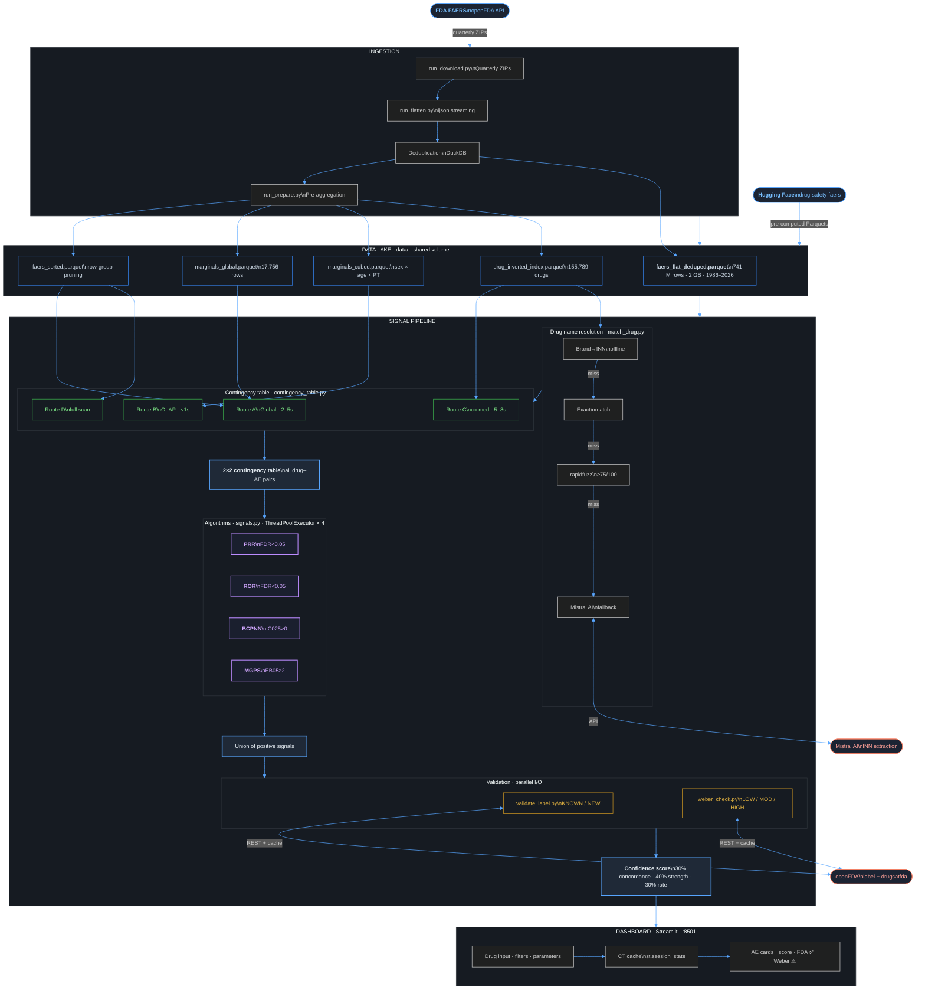
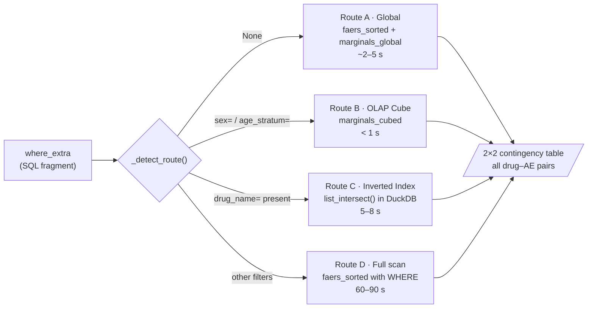

 # Drug Safety Signal Detection

[](https://www.python.org/)
[](https://duckdb.org/)
[](https://streamlit.io/)
[](https://www.docker.com/)
[](https://huggingface.co/datasets/annaferrari02/drug-safety-faers)
[](LICENSE)

A pharmacovigilance prototype that detects adverse event (AE) signals from the FDA FAERS database using four disproportionality analysis algorithms — PRR, ROR, BCPNN, and MGPS/EBGM — with an interactive Streamlit dashboard and optional signal stratification by sex, age group, and co-medication.

> **Academic project** — Data Science, University of Trento, Big Data Technologies Module 

---

## Table of Contents

- [Introduction](#introduction)
- [System Architecture](#system-architecture)
- [Technologies & Justifications](#technologies--justifications)
- [Core Components](#core-components)
- [Data Pipeline](#data-pipeline)
- [Signal Detection Algorithms](#signal-detection-algorithms)
- [Dashboard & Visualization](#dashboard--visualization)
- [Installation & Setup](#installation--setup)
- [Dataset & Performance](#dataset--performance)
- [Limitations & Future Work](#limitations--future-work)
- [Team & Contributors](#team--contributors)
- [References](#references)

---

## Introduction

Pharmacovigilance is the science of detecting, assessing, and preventing adverse drug reactions. Regulatory agencies and pharmaceutical companies routinely mine spontaneous reporting systems — databases where healthcare professionals and patients voluntarily report suspected adverse events — to identify safety signals that were not observed during clinical trials.

This system implements a **signal detection pipeline** on the FDA Adverse Event Reporting System (FAERS), a public database maintained by the U.S. Food and Drug Administration. Given a drug name, the system:

1. Resolves the input to the canonical INN (International Nonproprietary Name) used in FAERS
2. Builds a 2×2 contingency table for all drug–AE pairs, optionally stratified by demographics or co-medication
3. Runs four standard disproportionality algorithms in parallel
4. Validates detected signals against the official FDA drug label via the openFDA API
5. Checks for Weber effect bias (over-reporting in the period immediately following drug approval)
6. Ranks results by a composite confidence score and displays them in an interactive dashboard

### Why Disproportionality Analysis?

Disproportionality methods measure whether a drug–AE combination is reported **more than expected** given the overall reporting distribution in the database. They are the standard tool used by the EMA, FDA, and WHO's Uppsala Monitoring Centre for signal detection in spontaneous reporting databases.

Unlike clinical trials, spontaneous reporting data is observational and subject to biases (notoriety bias, Weber effect, masking). This system explicitly models and surfaces these biases to the user.

---

## System Architecture

The system is a Dockerized microservice pipeline with three main layers:

```
┌──────────────────────────────────────────────────────────────┐
│                     DATA LAYER                               │
│  FAERS raw JSON → flatten (ijson) → deduplicate (DuckDB)    │
│  → faers_flat_deduped.parquet  (741M rows, 2 GB)            │
│  → marginals_global.parquet  ·  marginals_cubed.parquet     │
│  → drug_inverted_index.parquet                               │
│  Hosted on Hugging Face Datasets (public, no credentials)    │
└───────────────────────────┬──────────────────────────────────┘
                            │
┌───────────────────────────▼──────────────────────────────────┐
│                   COMPUTATION LAYER                          │
│  src/contingency_table.py  — 4-route query engine (DuckDB)  │
│  src/signals.py            — PRR · ROR · BCPNN · MGPS       │
│  src/match_drug.py         — 4-step drug name resolution     │
│  src/validate_label.py     — openFDA label cross-reference   │
│  src/weber_check.py        — Weber effect bias detection     │
└───────────────────────────┬──────────────────────────────────┘
                            │
┌───────────────────────────▼──────────────────────────────────┐
│                  PRESENTATION LAYER                          │
│  dashboard/appli.py  — Streamlit UI                         │
│  Composite confidence score · FDA validation icons           │
│  Weber risk indicators · Stratification filters              │
└──────────────────────────────────────────────────────────────┘
```

### Contingency Table Routing

The most performance-critical component is the contingency table builder, which implements four query routes selected automatically based on the requested stratification:

| Route | Trigger | Data sources | Typical latency |
|-------|---------|--------------|-----------------|
| **A — Global** | No stratification filter | `faers_sorted.parquet` + `marginals_global.parquet` | 2–5 s |
| **B — OLAP cube** | Sex / age filter | `marginals_cubed.parquet` + `faers_sorted.parquet` | < 1 s |
| **C — Inverted index** | Co-medication filter | `drug_inverted_index.parquet` + `faers_sorted.parquet` | 5–8 s |
| **D — Full scan** | Any other filter | `faers_sorted.parquet` only | 60–90 s |

Route selection is automatic via regex matching on the `where_extra` SQL fragment. Routes A and B exploit pre-aggregated Parquet files; Route C uses a list-intersection index to avoid scanning all 741M rows.
### Contingency Table Routing Detail
 


---

## Technologies & Justifications

| Component | Technology | Justification |
|-----------|-----------|---------------|
| Core language | Python 3.13 | Rich data science ecosystem; native DuckDB and Streamlit integration |
| Query engine | DuckDB | Columnar in-process OLAP engine; scans 741M-row Parquet in seconds without a server; row group pruning on sorted Parquet achieves sub-second filtered queries |
| Data format | Apache Parquet | Columnar compression reduces 2 GB dataset to efficient on-disk footprint; DuckDB reads Parquet natively without loading into RAM |
| Stream parsing | ijson | Event-driven JSON parsing during ingestion; avoids loading multi-GB FAERS files into memory |
| Containerization | Docker Compose | Single-command reproducibility; all dependencies isolated; `python main.py` launches the full system |
| Dashboard | Streamlit | Rapid iteration on interactive UI; no frontend build toolchain required |
| Drug name resolution | rapidfuzz + Mistral AI | Handles brand names, typos, and non-English inputs; Mistral used as fallback for INN extraction |
| Signal validation | openFDA API | Cross-references detected signals against the official FDA label; distinguishes known AEs from potentially new signals |
| Data hosting | Hugging Face Datasets | Public, free, versioned artifact hosting; no credentials required for download; academic-friendly alternative to self-hosted object storage |
| Disproportionality algorithms | vigipy (vendored) | Reference implementation of PRR, ROR, BCPNN, MGPS; vendored with patches for numpy/scipy compatibility |

---

## Core Components

```
drug-safety-signal-detection/
├── main.py                        # One-shot launcher: download → build → run
├── appli.py / dashboard/appli.py  # Streamlit dashboard
├── signals/
│   └── run_signals.py             # Pipeline orchestrator (parallel execution)
├── src/
│   ├── contingency_table.py       # 4-route contingency table engine
│   ├── signals.py                 # Algorithm wrappers (PRR/ROR/BCPNN/MGPS)
│   ├── match_drug.py              # Drug name resolution cascade
│   ├── validate_label.py          # openFDA label validation
│   └── weber_check.py             # Weber effect bias detection
├── ingestion/
│   ├── run_download.py            # FAERS raw JSON download (idempotent)
│   ├── run_flatten.py             # Streaming flatten → Parquet
│   └── run_prepare.py             # Pre-aggregation (marginals, index)
├── vigipy/                        # Vendored disproportionality library
├── data/                          # Parquet files (downloaded at runtime)
│   ├── faers_flat_deduped.parquet
│   ├── faers_sorted.parquet
│   ├── marginals_global.parquet
│   ├── marginals_cubed.parquet
│   └── drug_inverted_index.parquet
├── docker-compose.yml
└── requirements.txt
```

### Drug Name Resolution (`src/match_drug.py`)

User input is resolved to the canonical FAERS drug name through a four-step cascade:

1. **Offline brand → INN dictionary** — covers common European/Italian brand names (Tachipirina → PARACETAMOL, Voltaren → DICLOFENAC, etc.) with zero latency
2. **Exact match** against the Parquet drug index (155,789 unique names)
3. **rapidfuzz fuzzy match** (token_set_ratio ≥ 75) — handles typos and partial names
4. **Mistral AI fallback** — extracts the INN from free-text input, then fuzzy-matches against the index

### Contingency Table Engine (`src/contingency_table.py`)

For a given drug, the engine builds a 2×2 table for every drug–AE pair:

|   | AE present | AE absent |
|---|-----------|----------|
| **Drug present** | a | b |
| **Drug absent** | c | d |

All four values are computed in a single DuckDB query using CTEs, entirely within the Parquet file. No Python round-trips; all joins stay native in DuckDB.
 
---

### Signal Detection (`src/signals.py`)

All four algorithms share the same `contingency_to_vigipy()` conversion and run in parallel via `ThreadPoolExecutor`:

- **PRR** (Proportional Reporting Ratio) — frequentist; signal if PRR ≥ 2 and FDR < 0.05
- **ROR** (Reporting Odds Ratio) — frequentist; similar to PRR but uses odds instead of proportions
- **BCPNN** (Bayesian Confidence Propagation Neural Network) — Bayesian; signal if IC025 > 0
- **MGPS/EBGM** (Multi-item Gamma Poisson Shrinker) — Bayesian; signal if EB05 ≥ 2. Uses fixed DuMouchel 1999 priors `[0.2041, 0.05816, 1.415, 1.838, 0.0969]` for small strata

A signal is included in the final output if flagged positive by **at least one** algorithm. The composite confidence score then ranks signals by algorithmic concordance, signal strength, and normalized reporting rate.

### Signal Validation

**FDA Label Validation (`src/validate_label.py`):** Each detected AE is cross-referenced against the official openFDA drug label. AEs found in the label are marked `KNOWN` (✅); others are marked `POTENTIALLY_NEW` (🔍). Results are cached locally in `label_cache.json` to avoid redundant API calls.

**Weber Effect Check (`src/weber_check.py`):** The Weber effect is a well-documented bias in spontaneous reporting databases: adverse event reports cluster in the period immediately after a drug's market authorization, then decline regardless of actual pharmacological risk. The check fetches the FDA approval year from the `drugsatfda` endpoint and analyzes the quarterly report distribution to classify bias risk as LOW 🟢, MODERATE 🟡, or HIGH 🔴.

---

## Data Pipeline

### Ingestion (`ingestion/`)

1. **Download** (`run_download.py`) — fetches all FAERS quarterly ZIP files from the openFDA manifest; idempotent (skips already-downloaded quarters)
2. **Flatten** (`run_flatten.py`) — parses each JSON file with `ijson` (streaming, one report at a time), extracts drug×reaction pairs, normalizes age/sex/date fields, and writes batches to `faers_flat.parquet` via PyArrow `ParquetWriter`
3. **Deduplicate** (`run_flatten.py`) — FAERS includes follow-up reports that supersede earlier submissions; deduplication keeps only the most recent version of each `safetyreportid` using DuckDB directly on Parquet

### Pre-aggregation (`ingestion/run_prepare.py`)

Three optimized Parquet files are built once at ingestion time and reused at query time:

- **`marginals_global.parquet`** — per-drug and per-AE total counts across the full database (17,756 rows); used by Route A to avoid full scans
- **`marginals_cubed.parquet`** — OLAP cube of marginal counts pre-stratified by sex × age_stratum; used by Route B
- **`drug_inverted_index.parquet`** — for each drug, the list of `safetyreportid`s in which it appears (155,788 rows); used by Route C via `list_intersect()` in DuckDB

The pre-aggregated files are hosted on Hugging Face and downloaded automatically by `main.py` at first run.

---

## Signal Detection Algorithms

All four algorithms operate on the same 2×2 contingency table. They differ in their statistical framework and sensitivity/specificity tradeoffs:

| Algorithm | Framework | Metric | Signal threshold | Best for |
|-----------|-----------|--------|-----------------|----------|
| PRR | Frequentist | Proportional Reporting Ratio | PRR ≥ 2, FDR < 0.05 | Large n, well-powered |
| ROR | Frequentist | Reporting Odds Ratio | ROR ≥ 2, FDR < 0.05 | Asymmetric drug-AE distributions |
| BCPNN | Bayesian | IC (Information Component) | IC025 > 0 | Small n; shrinks toward prior |
| MGPS/EBGM | Bayesian | Empirical Bayes Geometric Mean | EB05 ≥ 2 | Sparse data; conservative |

The **composite confidence score** (0–100) weights algorithmic concordance (30%), signal strength (40%), and normalized reporting rate a/(a+b) (30%). This reweighting surfaces common genuine AEs that pure disproportionality metrics may suppress due to masking bias.

---

## Dashboard & Visualization

The Streamlit dashboard provides a single-page interface where users input a drug name, optional stratification filters, and algorithm parameters, then receive a ranked list of detected adverse events.

**Main features:**

- Drug name input with automatic brand → INN resolution and match confidence display
- Stratification by sex (`male` / `female`), age group (`pediatric` / `adult` / `geriatric`), and co-medication
- Configurable algorithm parameters (FDR threshold, EB05, IC025, minimum occurrences)
- AE result cards with:
  - Composite confidence score bar (color-coded: blue ≥ 60, amber 35–60, red < 35)
  - Algorithm concordance pills (which of PRR/ROR/BCPNN/MGPS flagged it)
  - FDA label validation icon (✅ known / 🔍 potentially new)
  - Weber effect risk indicator (🟢 / 🟡 / 🔴)
- Contingency table cache: if the drug and filters have not changed, re-running with different algorithm parameters skips the DuckDB query entirely
- Full signal table download (CSV)
- Weber effect detail expander (quarterly report distribution, trend slope, peak offset)

### AI-powered adverse event explanations

Each signal card includes an expandable **"More details"** section powered by [Mistral AI](https://mistral.ai). When opened, the dashboard sends the adverse event (MedDRA preferred term) and drug name to the Mistral API, which returns a 2-sentence clinical explanation written for healthcare professionals: one sentence describing what the adverse event is, one describing its known or suspected relationship with the drug.

The explanation is generated on demand (lazy loading) — no API call is made until the user opens the expander. If the Mistral API key is not configured, the section displays "AI explanation unavailable" without blocking the rest of the results.

Each card also includes a direct link to [MedlinePlus](https://medlineplus.gov) for the corresponding condition. Single-word MedDRA terms resolve to a direct article page; multi-word terms fall back to the MedlinePlus search index. URL validity is verified at runtime with a HEAD request and cached per session.

---

## Installation & Setup

### Prerequisites

- Docker and Docker Compose
- Python 3.9+ (only for running `main.py`; the pipeline itself runs inside Docker)
- 8 GB RAM minimum (16 GB recommended)
- ~5 GB free disk space (pre-computed Parquet files downloaded automatically)
- Internet connection (for Parquet download from Hugging Face and openFDA API calls)

### Quick start

```bash
git clone https://github.com/annaferrari02/drug-safety-signal-detection.git
cd drug-safety-signal-detection
python main.py
```

`main.py` handles everything automatically:

1. Checks Python and Docker prerequisites
2. Downloads pre-computed Parquet files from Hugging Face (`annaferrari02/drug-safety-faers`) if not already present
3. Builds the Docker image
4. Starts the dashboard container
5. Opens the browser at `http://localhost:8501`

### Mistral API key (drug name resolution fallback)

Create a `.env` file in the project root:

```
MISTRAL_API_KEY=your_key_here
```

Without this key, drug name resolution uses the offline dictionary and fuzzy matching (steps 0–2). Moreover, there will be no common-terms explanation of adverse events.

### Optional: Rebuild from raw FAERS data

If you want to re-run the full ingestion pipeline instead of using the pre-computed Parquet files:

```bash
cd ingestion
python run_download.py   # downloads all FAERS quarters (~1700 JSON files)
python run_flatten.py    # streaming flatten + deduplication
python run_prepare.py    # builds marginals and inverted index
```

> ⚠️ Full ingestion requires ~50 GB disk space for raw files and several hours of processing time. The pre-computed Parquet files on Hugging Face are the recommended path for academic use.

---

## Dataset & Performance

### FAERS Dataset Statistics

| Metric | Value |
|--------|-------|
| Source | FDA Adverse Event Reporting System (FAERS) |
| Period covered | 1986–2026 (40 years) |
| Unique FAERS reports | 1,079,930 |
| Drug × Reaction pairs (after deduplication) | 741,343,876 |
| Unique drugs in index | 155,789 |
| Dataset size (Parquet, compressed) | ~2 GB |
| Pre-aggregated files | ~40 MB total |

### Query Performance (approximate, on commodity hardware)

| Query type | Route | Latency |
|-----------|-------|---------|
| Global (no filter) | A — sorted + marginals | 2–5 s |
| Sex or age filter | B — OLAP cube | < 1 s |
| Co-medication filter | C — inverted index | 5–8 s |
| Repeated query (cached CT) | — | < 0.1 s |
| Algorithms (PRR+ROR+BCPNN+MGPS, parallel) | — | 1–3 s |
| openFDA validation (first call) | — | 2–5 s |
| openFDA validation (cached) | — | < 0.1 s |

---

## Limitations & Future Work

### Current Limitations

**Data source:** FAERS is a spontaneous reporting database. Reports are voluntary and heterogeneous in quality. The system detects statistical signals, not proven causal relationships.

**Known biases not fully corrected:**
- *Notoriety bias*: widely publicized drug safety issues generate disproportionate reporting
- *Weber effect*: explicitly detected and flagged, but not corrected for in the signal scores
- *Indication confounding*: patients taking a drug for a serious condition may have that condition as a confounder for AE detection
- *Masking / competition bias*: high-reporting drugs can suppress signals for less-reported AEs

**Algorithm limitations:**
- Frequentist methods (PRR, ROR) become unreliable at small n; the `min_a` threshold mitigates this but does not eliminate it
- MGPS uses fixed DuMouchel 1999 priors because prior optimization diverges on sparse strata (co-medication + sex + age combinations)
- No multiple testing correction across the full drug–AE space (only within a single drug query)

**Infrastructure:**
- Single-node deployment; not designed for concurrent users or production workloads
- No persistent database; all state is in Parquet files and JSON caches

### Potential Improvements

- **Confounder adjustment**: implement propensity score stratification or logistic regression to control for indication
- **MedDRA hierarchy**: aggregate signals at SOC (System Organ Class) level in addition to PT (Preferred Term)
- **Kubernetes deployment**: dynamic scaling for multi-user academic or institutional use

---

## Team & Contributors

| Name | Contact |
|------|------|
| Anna Ferrari | @annaferrari02 |
| Margherita Todesco |  @margh3rita |
| Giulia De Bei | @GiDiBi03 |

---

## References

[1] Evans, S. J. W., Waller, P. C., & Davis, S. (2001). Use of proportional reporting ratios (PRRs) for signal generation from spontaneous adverse drug reaction reports. *Pharmacoepidemiology and Drug Safety*, 10(6), 483–486.

[2] Rothman, K. J., Lanes, S., & Sacks, S. T. (2004). The reporting odds ratio and its advantages over the proportional reporting ratio. *Pharmacoepidemiology and Drug Safety*, 13(8), 519–523.

[3] Bate, A., Lindquist, M., Edwards, I. R., Olsson, S., Orre, R., Lansner, A., & De Freitas, R. M. (1998). A Bayesian neural network method for adverse drug reaction signal generation. *European Journal of Clinical Pharmacology*, 54(4), 315–321.

[4] DuMouchel, W. (1999). Bayesian data mining in large frequency tables, with an application to the FDA Spontaneous Reporting System. *The American Statistician*, 53(3), 177–190.

[5] Weber, J. C. P. (1984). Epidemiology of adverse reactions to nonsteroidal anti-inflammatory drugs. In *Advances in Inflammation Research* (Vol. 6, pp. 1–7). Raven Press.

[6] Hauben, M., & Bate, A. (2009). Decision support methods for the detection of adverse events in post-marketing data. *Drug Discovery Today*, 14(7–8), 343–357.

[7] FDA Adverse Event Reporting System (FAERS). U.S. Food and Drug Administration. https://www.fda.gov/drugs/questions-and-answers-fdas-adverse-event-reporting-system-faers

---

## License

MIT License — see [LICENSE](LICENSE) for details.
